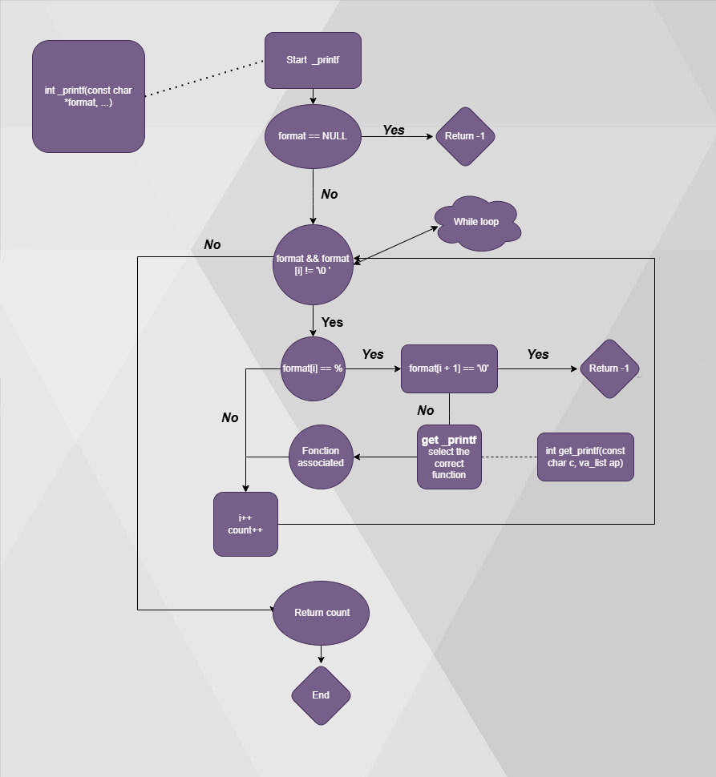

# _printf
This is a repository where Printf has been recreated, printf is a C standard library function that formats text and writes it to standard output. The name, printf is short for print formatted where print refers to output.

# File
* [main.h](./main.h) - Header file with all the prototypes of the functions used in the project.
* [_printf.c](./_printf.c) - Function that prints a formatted string.
* [_putchar.c](./_putchar.c) - Function that prints a character.
* [functions.c](./functions.c) - File with the functions that print the different types of data.
* [functions2.c](./functions2.c) - File with the functions that print the different
* [functions_unsigned.c](./functions_unsigned.c) - File with the functions that print the different types of unsigned data.
* [get_printf.c](./get_printf.c) - Function that selects the correct function to perform the operation.		
* [man_3_printf](./man_3_printf) - Manual of the _printf function.
# Command compilation

```
$ gcc -Wall -Werror -Wextra -pedantic -std=gnu89 -Wno-format *.c
```

# Requirements

-   All our files will be compiled on Ubuntu 20.04 LTS 
-   All your files should end with a new line
-   A `README.md` file, at the root of the folder of the project is mandatory
-   Your code should use the `Betty` style.
-   We are not allowed to use global variables
-   No more than 5 functions per file
-   The prototypes of all your functions should be included in your header file called `main.h`
-   All your header files should be include guarded
-  We are not allowed to use `printf`  

# Exemple 

```
len = _printf("Let's try to printf a simple sentence.\n");
```
```
Let's try to printf a simple sentence.
```
```
 _printf("Negative:[%d]\n", -762534);
```
```
Negative:[-762534]
```
# Testing
We tested our code in parallel with printf to see where we had errors:
`~/holbertonschool-printf$ ./a.out
Let's try to printf a simple sentence.
Let's try to printf a simple sentence.
Character:[H]
Character:[H]
String:[I am a string !]
String:[I am a string !]
Percent:[%]
Percent:[%]
Null string:[(null)]
Null string:[(null)]`


# Flowchart 



# Authors
Sébastien Georgescu  

Github: https://github.com/sebgrgs

Cratere Esteban  
 
Github: https://github.com/Callacos